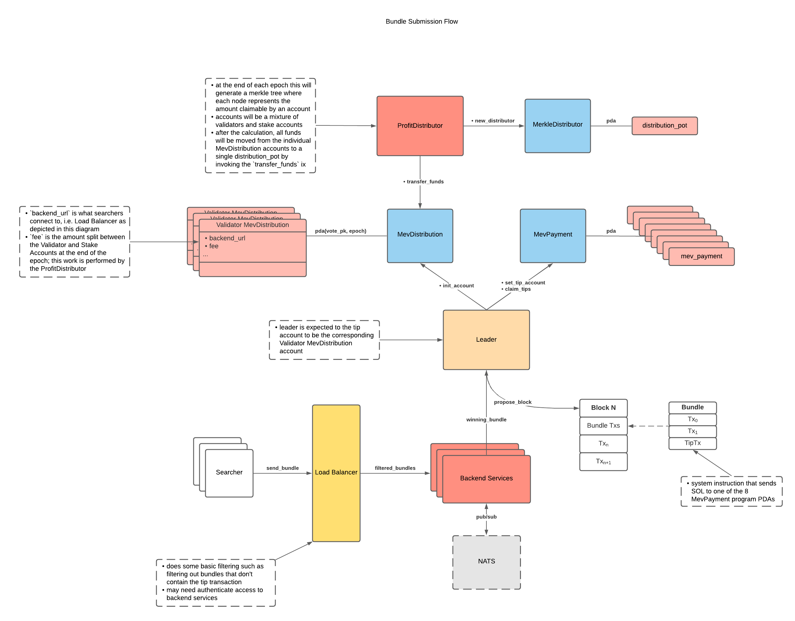
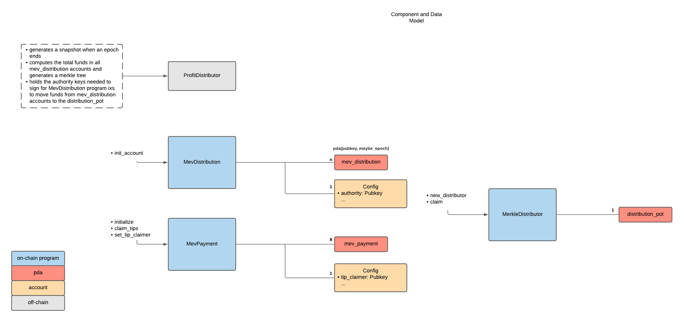
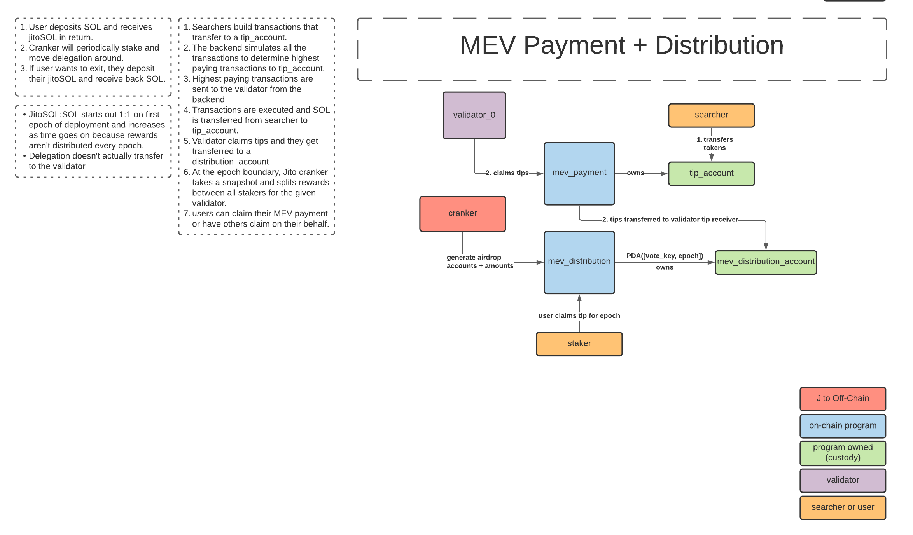

# Mev Programs
This repository holds a set of programs necessary for the functioning of the Mev Distribution DAO.

## mev-payment
This program owns 8 tip accounts that act as ephemeral storage of tips. The reason for eight separate accounts is so
that Solana's Sealevel Runtime's parallelism can be taken advantage of. In theory, this means 8 bundles can be executed
in parallel by the Validator's Bank. However, this is not the case right now and is out of the scope of this README's.

### Instructions
* initialize
  * inits the `mev_payment` PDAs along with the `Config` PDA
* claim_tips
  * transfer funds from all 8 `mev_payment` accounts to the `tip_claimer` account
* set_tip_claimer
  * checks to see if there are any funds left in the `mev_payment` accounts; and if so transfers to previous `tip_claimer`
    before setting the new `tip_claimer`

## Tests
Tests are located at the `./tests` folder. Simply run `anchor test` to execute.

## Example Workflow
1. Slot begins
2. Leader invokes `set_tip_claimer` and includes it as the first tx in the block
3. Searchers send bundles (includes tips to one or all of the `mev_payment` accounts)
4. Leader invokes `claim_tips` and includes it as the last tx in the block
5. Slot ends
6. Repeat steps 1-5 until next Leader is rotated, rinse and repeat

## Architecture

